<h1 style="font-size: 48px"><a href="https://lyntr.com">Lyntr.com</a> - the micro-blogging social media with an IQ test</h1>
[Privacy Policy](https://lyntr.com/privacy) | [Terms of Service](https://lyntr.com/tos) | [License](https://github.com/face-hh/lyntr/blob/master/LICENSE.md) | [YouTube video](https://youtu.be/-D2L3gHqcUA)

# Images
Dark mode - Lyntr


Light mode - Lyntr

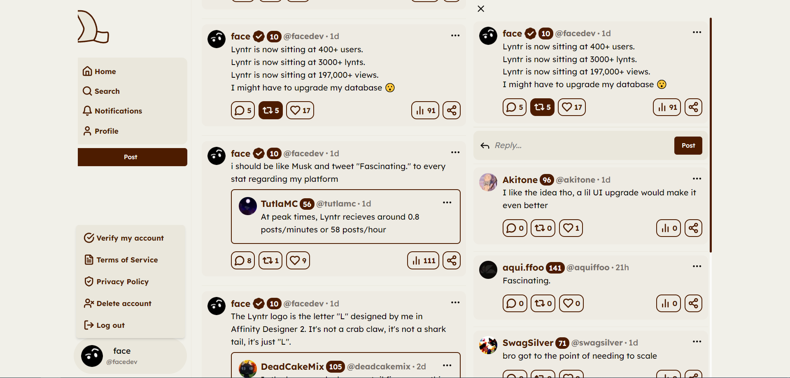

# Issues
PLEASE before you make a issue read all the open and closed issues, use the search make sure a similar issue hasn't been posted by someone else before you make a new issue!

If you have anything to add to a issue you can do so. Anymore information about a particular issue will be helpful!

# Self-host
First, we need to setup the `.env` file with the right secrets.
- Rename `.env.example` to `.env`

## Database
Firstly we have to setup the database we are going to use supabase here but you should be able to use any postgres database. Head to https://supabase.com and **create an account.**

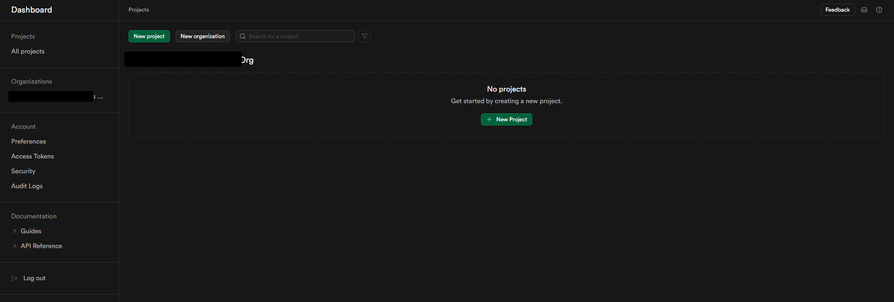

Now, click **"New project"**.

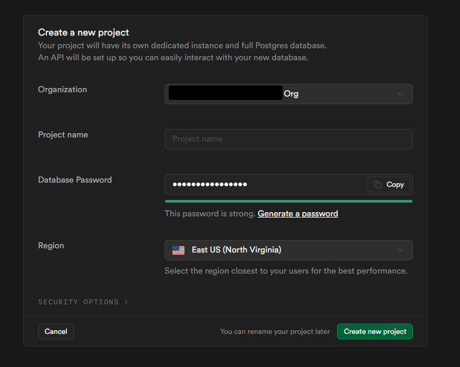


For the **project name**, choose whatever name you wish.
For the **database password**, you could generate a random password or input yours. **Make sure to save it.**
For the **region**, choose the region closer to your machine.

Then click **Create new project**. It will take a few minutes, so in the meantime you can copy the secrets.

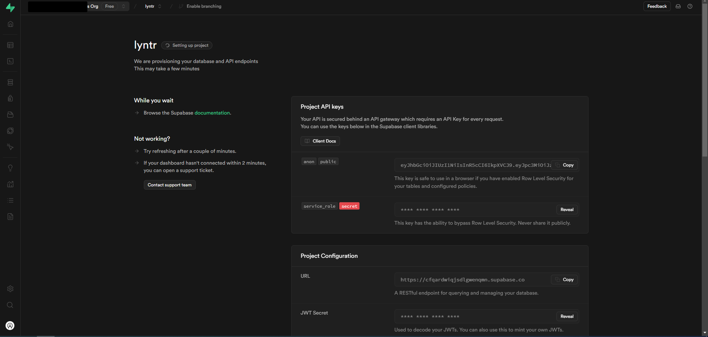
On this page we can see the **Project API keys** and **Project configuration** sections.

- Copy the `Project Configuration` > `JWT Secret`:
- You could also generate one with password sites or `node -e "console.log(require('crypto').randomBytes(32).toString(hex));"`
```python
JWT_SECRET="..........x............x........."
```

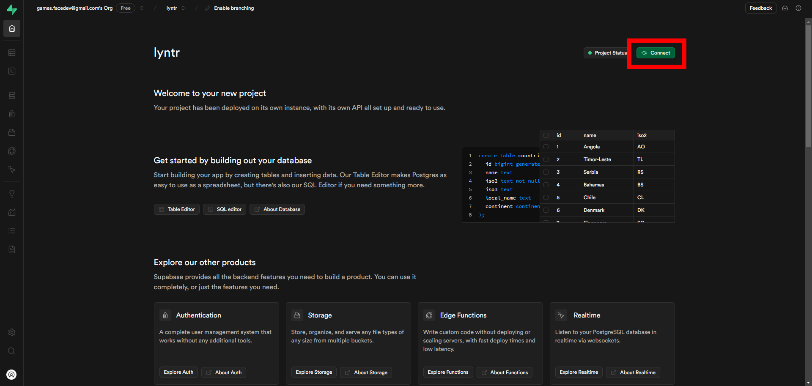
Now that the Database has been created, click **"Connect"**.
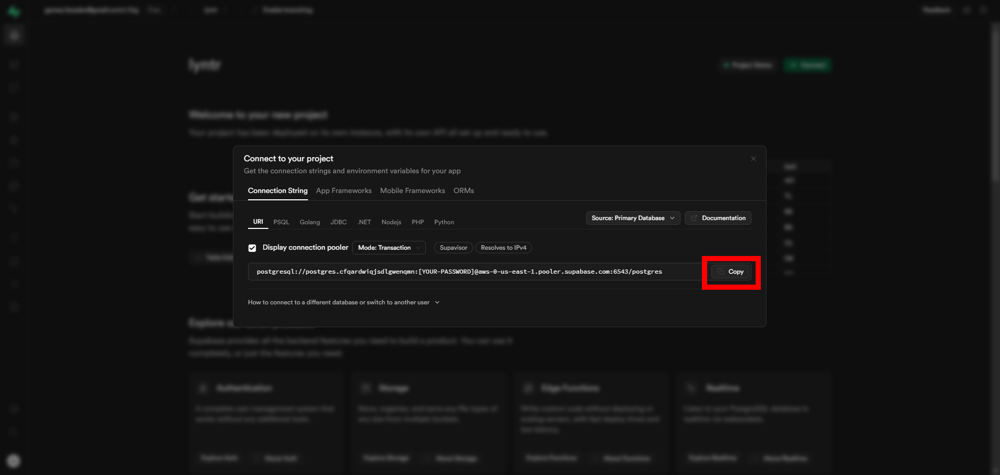
Copy the URL and put it in your `.env`:
```python
DATABASE_URL="postgresql://postgres.USERNAME:PASSWORD/options"
```
If you clicked `Copy` on the Connect page, you should already have the `USERNAME`. Simply replace `PASSWORD` with the one you put at:
> For the **database password**, you could generate a random password or input yours. **Make sure to save it.**

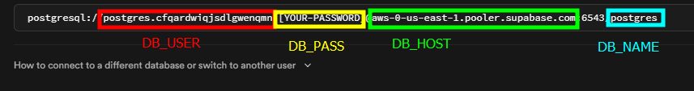

Now run the following:
```bash
npx drizzle-kit generate
npx drizzle-kit migrate
npx drizzle-kit push
```

## Discord
Now that the database is set up you will need to create a application on the [Discord Developer Portal](https://discord.com/developers/docs/intro)

You can then copy the client id and client secrets into the corresponding lines of your env:
```python
PUBLIC_DISCORD_CLIENT_ID=""
DISCORD_CLIENT_SECRET=""
```

## Ratelimits
For ratelimits we use [upstash redis](https://upstash.com/).

Create a redis and then copy these values into your env.
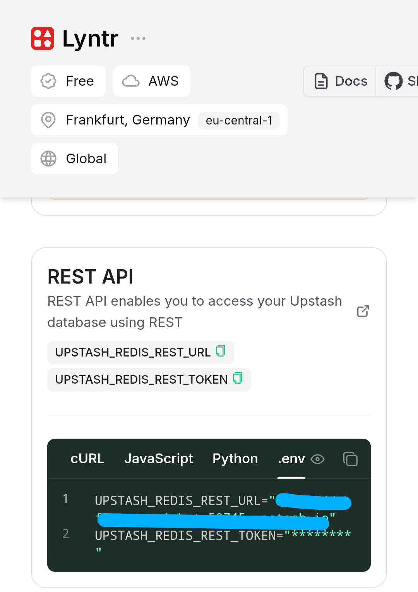

## MinIO
We need Min.io for images. This and the next step can be omitted if you don't need *Image support* / *reporting*.

### Setup
Install [Docker](https://docs.docker.com/engine/install/) and run the following command:
```bash
MINIO_USER=admin MINIO_PASS=admin docker compose up --build -d
```
‼ This may fail if you haven't followed the Supabase step properly (because the `compose.yml` file also starts Lyntr in production at 5999 port.)

After that's done, navigate to `https://localhost:9001`. You will see this.

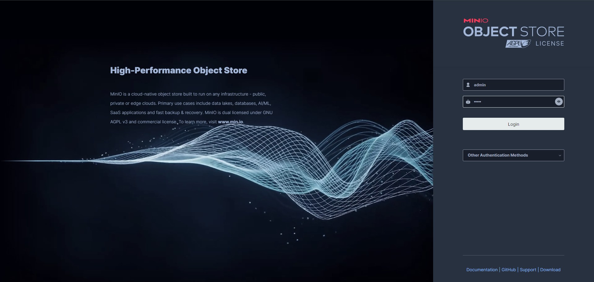
If you followed the Docker command properly, the username and password should both be `admin`. Log in.

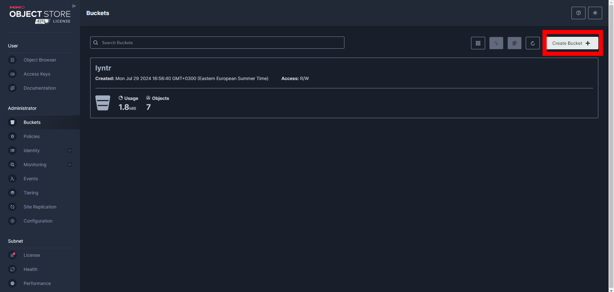
Create a bucket.

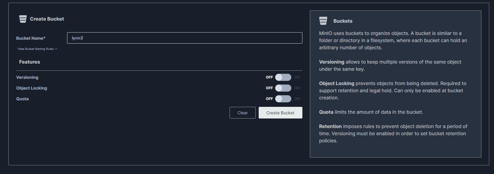
Input a bucket name and click Create Bucket.

And change the `.env`:
```python
S3_BUCKET_NAME="the_name_you_chose"
```

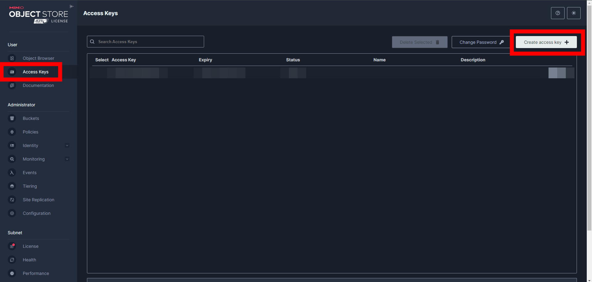
Now navigate to **"Access Keys"** and click **"Create Access key"**

Simply copy the **Access key** and **Secret key** and update your `.env` accordingly:
```python
MINIO_ACCESS_KEY="first_field"
MINIO_SECRET_KEY="second_field"
```
Then click "Create".

### Great, now we have to make the bucket public so we can access it at `http://localhost:9000/lyntr/` without a token.

Run this:
```bash
docker exec -it minio sh -c "mc alias set myminio http://localhost:9000 "admin" "admin" && mc anonymous set public myminio/lyntr"
```

And you're good to go! You can now simply go to `http://localhost:5999` to access Lyntr locally, or run `npm i && npm run dev` in your terminal for dev mode and access it at `http://localhost:5173/`.

If you wish to get Reporting to work, follow the last step.

## Discord
- [Create a Discord bot](https://discordpy.readthedocs.io/en/stable/discord.html) and copy the token.
- Create a Discord server and invite the bot there.
- Create a Channel and copy its ID.
- Create a Role, give it to yourself, and copy its ID.

Now update the `.env`:
```python
DISCORD_BOT_TOKEN="discord.token.here"
DISCORD_CHANNEL_ID="channel.id.here"
ADMIN_KEY="can.be.anything.just.make.sure.its.secure"
SUDO_USER_ID="your.lyntr.account.id" # Create a Lyntr account and copy its ID. If this field won't be filled, your bot will fail to fetch `api/lynt` at GET for info on report. Check the Network tab for the `api/me` request and copy the ID it returns.

DISCORD_ADMIN_ROLE="your.admin.role"
```

# Contributing
If you wish to contribute, you are free to do so. Please keep in mind:
- Don't open pull requests that simply fix grammatical issues or such. Open an issue instead.
- Don't modify the IQ test unless it's a bug fix.
- Don't submit "troll" pull requests.
- Don't submit pull requests that rewrite a part of the project. **Please create a GitHub issue and ask if such a rewrite is welcome before starting.**

# License
This project is licensed under **Attribution-NonCommercial 2.0 International**.
### You are free to:
#### 📩✅ Share — copy and redistribute the material in any medium or format
#### 🔁✅ Adapt — remix, transform, and build upon the material

The licensor cannot revoke these freedoms as long as you follow the license terms.

### Under the following terms:
#### 👤✅ Attribution — You must give appropriate credit, provide a link to the license, and indicate if changes were made. You may do so in any reasonable manner, but not in any way that suggests the licensor endorses you or your use.
#### 💵❌ NonCommercial — You may not use the material for commercial purposes.
#### 📜❌ No additional restrictions — You may not apply legal terms or technological measures that legally restrict others from doing anything the license permits.

### Please refer to [CC BY-NC 2.0](https://creativecommons.org/licenses/by-nc/2.0/deed.en) for more information.

Created by FaceDev
